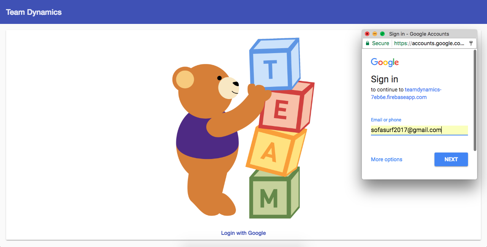
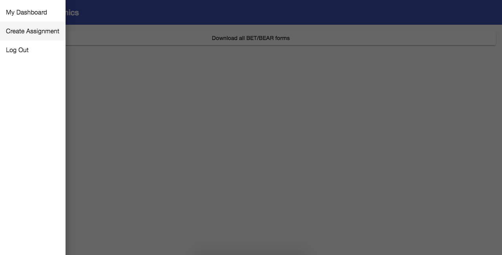
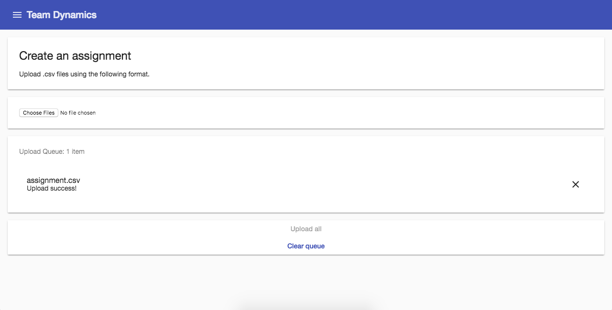
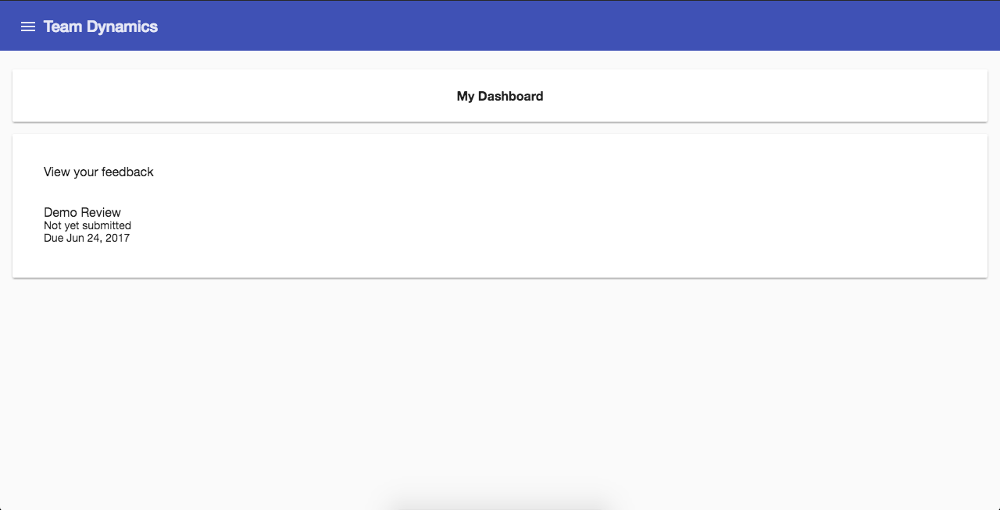
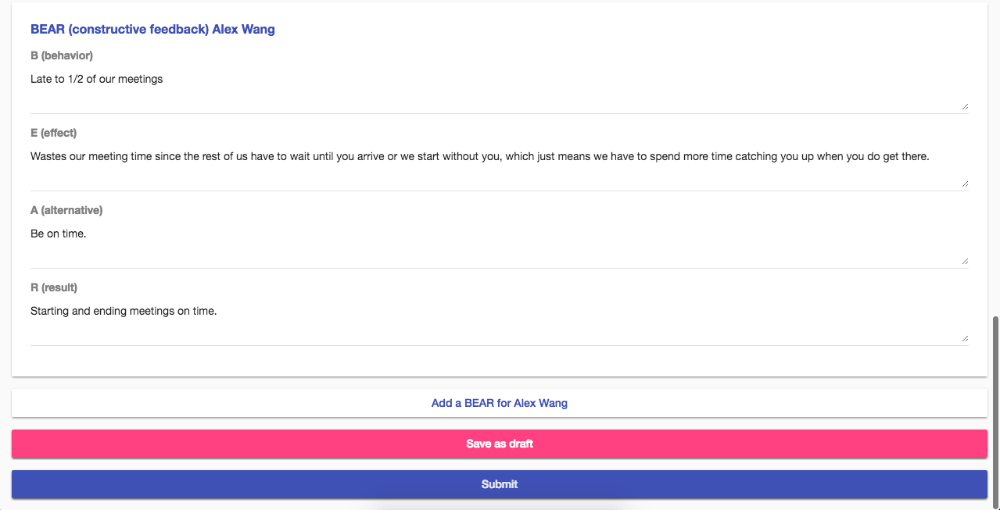
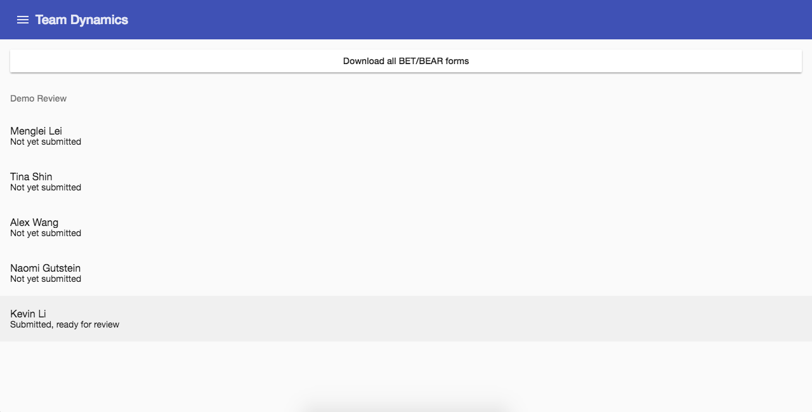
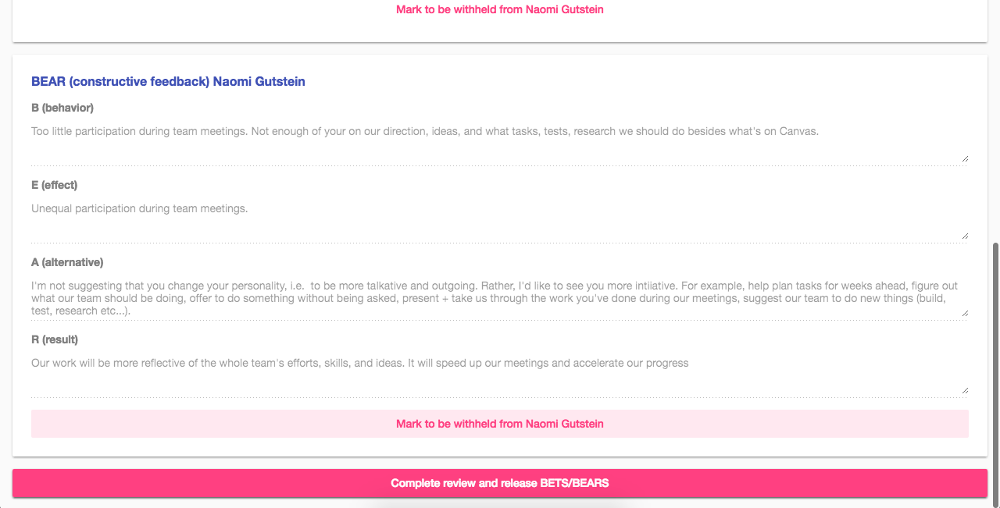
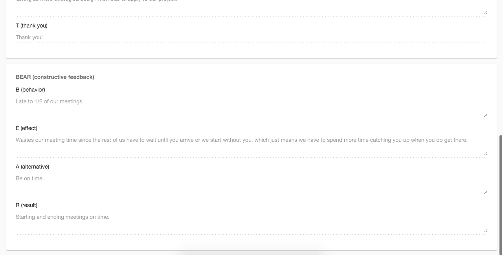

# TeamDynamics

This project was created for EECS 394 in Spring of 2017.

## Project status

### Implemented functionality

Instructors can:
- upload a .csv file containing information for a new assignment. The server will create new student accounts as needed as well as all the BET/BEAR forms for an assignment.
- monitor the status of individual assignments (not yet started, started, submitted).
- release BETs and BEARs of completed forms.
- Download all information in the system as a .csv file for safe keeping.

Students can:
- see all assignments that they have to complete and their statuses (not yet started, started, submitted).
- save a partially completed assignment to come back to later.
- view BET/BEAR feedback that has been released by the instructor.
- download all released BET/BEAR feedback as a .csv file for safe keeping.

### Sample workflow

Sally is the instructor of a class in which Kevin, Naomi, and Alex are one team and MengLei and Tina are on a second team.

Sally logs on to Team Dynamics with her instructor account.

Sally arrives at her dashboard, sees that there are no current assignments and navigates to the create new assignment page.

Sally uploads a .csv file according to the sample on the page. This creates the student accounts and the appropriate forms.

Kevin logs on to the system with his Northwestern email account and sees that there is a new assignment due soon.

Kevin opens the form and fills out BETs/BEARs for his team mates and submits the form.

Sally navigates to her dashboard and sees that Kevin has completed his assignment.

Sally opens Kevin's assignment and marks individual BETs/BEARs for release and completes her review.

Alex, one of Kevin's team mates, navigates to his feedback and reads through the anonymous BETs/BEARs.

## Development notes

### Tools, resources

A list of the tools (and some resources) we used on this project that would be good for future developers to familiarize themselves with:

- node, npm, nodemon
- [Angular 2](https://angular.io/)
- [Angular CLI](https://cli.angular.io/)
- [Firebase](https://firebase.google.com/docs/web/setup), [AngularFire2](https://github.com/angular/angularfire2)
- [Heroku](https://devcenter.heroku.com/categories/nodejs), [Deploying Angular 2 apps to Heroku](https://medium.com/@ryanchenkie_40935/angular-cli-deployment-host-your-angular-2-app-on-heroku-3f266f13f352)
- [Angular Material](https://material.angular.io)

### Live server

The website is currently hosted at `https://infinite-ravine-89186.herokuapp.com`.

### Development server

Run `ng build -prod && node server.js` for a dev server. Navigate to `http://localhost:3000`.

### Future steps and known bugs

- Data validation (such as: students can only see their own forms and their own feedback; forms that have already been submitted cannot be submitted again; forms that are past their due date cannot be submitted) is currently handled on the front end. For a secure product, this validation needs to be moved to server side.
- The system is currently designed for a single class. In order to handle multiple classes, assignments and forms need to be linked to specific instructors (this is a minor change if each class has a single instructor).
- Authentication is currently done through Google login. We verify on the front end that the log in information matches some account in the system. However, only Google authentication is needed to edit the database. In the future this authentication needs to be handled on the back end and changed to a Northwestern NetID log in.
